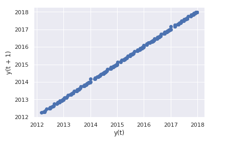
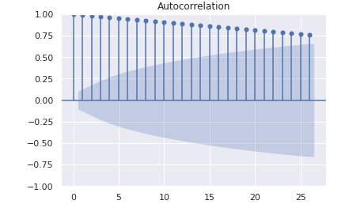
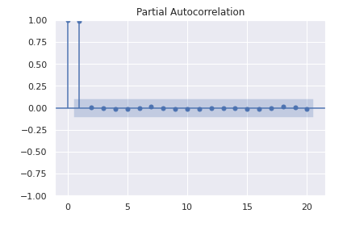
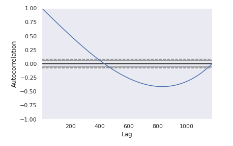
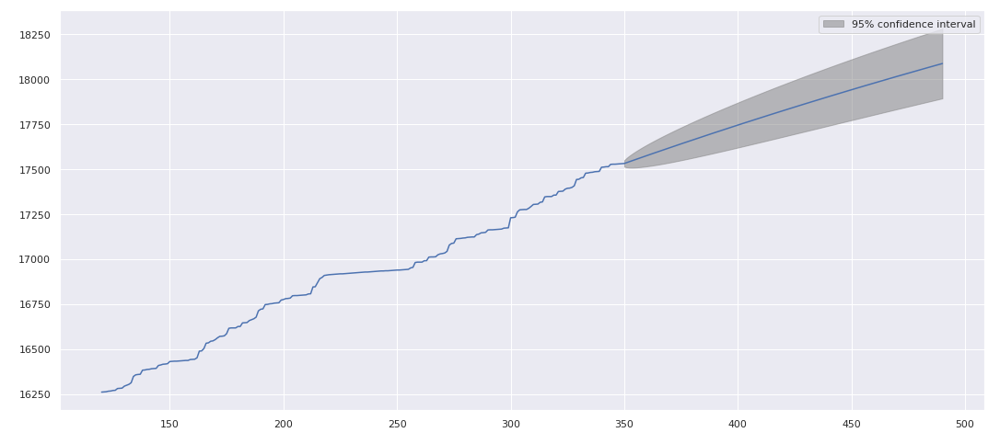
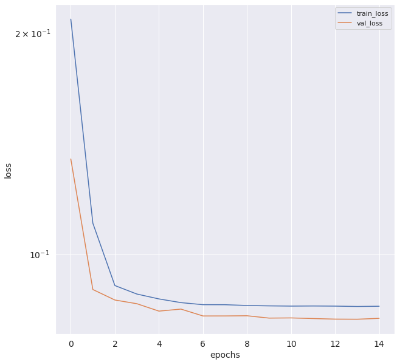

# DS-Project-9-Forecasting_Store_Sales_TimeSeriesAnalysis
Designed a model that Forecasts Store Sales.

* Forecasts are very important for bussinesses and stores as they must be aware of how much inventory to buy. Predict a little over, and stores are stuck with overstocked, perishable goods. Guess a little under, and popular items quickly sell out, leading to lost revenue and upset customers.Thanks to Data Science and Machine Learning, we can get more accurate forecasts.
* Dataset - Part of a Kaggle competition. Dataset contains grocery store data sales from Corporación Favorita, a large Ecuadorian-based grocery retailer.
* Model - The major aim in this project is to build a model that more accurately predicts the unit sales for thousands of items sold at different Favorita stores using Time Series Analysis methods and Deep Learning algorithms.

## Code and Resources Used ##
**Python Version:** 3.10.5  
**Packages:** pandas, numpy, keras, matplotlib, seaborn, statsmodels, warnings   
**For Web Framework Requirements:** _pip install -r requirements.txt_  
**Data Resources:** <https://www.kaggle.com/competitions/store-sales-time-series-forecasting/data>

## About the Dataset ##

The training data includes dates, store and product information, whether that item was being promoted, as well as the sales numbers.  

Additional files include supplementary information very important for time series analysis are provided. They are as follows:  
- stores.csv - Store metadata, including city, state, type, and cluster 
- oil.csv - Daily oil price. Includes values during both the train and test data timeframes.Ecuador is an oil-dependent country and it's economical health is highly      vulnerable to shocks in oil prices.  
- holidays_events.csv - Holidays and Events, with metadata.Important factor that affects store sales largely.  
[Note:  Also has additional information for more complex analysis] 

## Time Series Data Analysis ## 
- Dropped null values .
- Transforming the Date(s) into date series format. This is an import step as its the only format in which we can process this data forTime Series Analysis.
- Creating Lag plots for the datasets - Purpose of lag plots is to notice if there are any trends/randomness in our datasets.We want the data to be as stationary as possible for our model.

- Plotting the Autocorrelation and Partial Autocorrelation - This allows us to check the randomness in the time series.ACF and PACF explains how the present value of a given time series is correlated with the past

- We then plot the Autocorrelation against Lag plots to visualize where the randomness occurs. 

## Autoregression Time Series Model ##
It is a time series model that uses observations from previous time steps as input to a regression equation to predict the value at the next time step. Basically it predicts future behavior based on past behavior.

After fitting the model with the dates data , we visualize the forecast.

The 95% confidence level states that there are only 5% chances of us being not correct.

Finally I predict outsample outputs using the forecast function of the model after fitting the data.

## Forcasting using Deep Learning Algorithms ##
I use a RNN model to carry out this task . RNN refers to Recurrent Neural Network. It is  a type of Neural Network where the output from previous step are fed as input to the current step. This is very important for my model as I want it to remember the trends from the previous inputs.

### Model Layers ###
 - Consists of a GRU layer that takes number of units in the RNN Layer and the input shape
 - A deep layer - deeply connected, receives all the data from all the neurons in the previous layer. Takes the steps variable(no. of days I want to forecast for)
 - optimizer - 'RMSprop' : takes larger steps in the horizontal direction
 - loss - 'mse' : Mean squarred error
 
After necessary preprocessing of the data like splitting into test and train datasets , converting it into a Numpy array, reshaping it and including the lag variable, creating validation sets, I train the model using it.

## Visualizing Train Loss and  Val_Loss against Epochs ##

Plotting the loss value of the training dataset and the validation dataset against the number of epochs.

